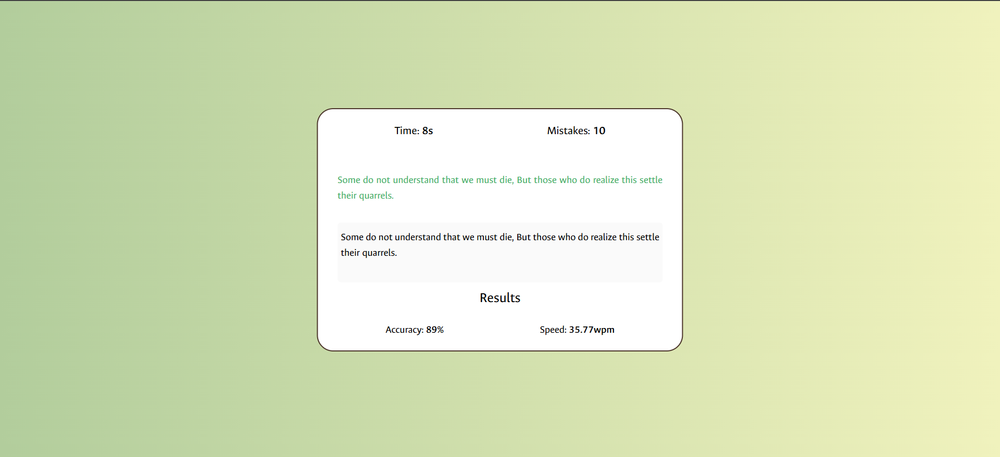

# TypeSpeedTest

A minimalistic web app to test your typing speed and accuracy. Get a random quote, type it as fast and accurately as you can, and see your results instantly!

## Features

- Fetches random quotes (80–100 chars) from [Quotable API](https://api.quotable.io/)
- Real-time mistake highlighting (green for correct, red for incorrect)
- Timer countdown (60 seconds)
- Calculates Words Per Minute (WPM) and accuracy
- Responsive, clean UI with Tailwind CSS and custom styles

## How It Works

1. **Start the Test:**  
   Click "Start Test" to begin. A random quote appears, and the timer starts counting down from 60 seconds.

2. **Type the Quote:**  
   As you type, each character is checked:
   - Correct characters turn green.
   - Incorrect characters turn red and increment the mistake counter.

3. **Finish:**  
   - The test ends when you finish typing the quote or when the timer reaches zero.
   - Your WPM and accuracy are displayed.

## File Structure

- [`index.html`](index.html): Main HTML file, includes UI layout and links scripts/styles.
- [`style.css`](style.css): Custom styles and font imports.
- [`script.js`](script.js): Core logic for fetching quotes, handling input, timing, and result calculation.
- `preview.png`, `test.png`: Images for preview and favicon.

## Core Logic

- **Quote Fetching:**  
  Uses the Quotable API to get a random quote of suitable length.

- **Input Handling:**  
  Each character typed is compared to the quote. Mistakes are tracked and highlighted.

- **Timer:**  
  A 60-second countdown is managed with `setInterval`. The timer stops on completion or when time runs out.

- **Results:**  
  WPM is calculated as `(characters typed / 5) / (minutes taken)`.  
  Accuracy is calculated as `((characters typed - mistakes) / characters typed) * 100`.

## Getting Started

1. Clone or download this repository.
2. Open `index.html` in your browser.
3. Start typing!

## Dependencies

- [Tailwind CSS CDN](https://cdn.tailwindcss.com)
- [Quotable API](https://api.quotable.io/)